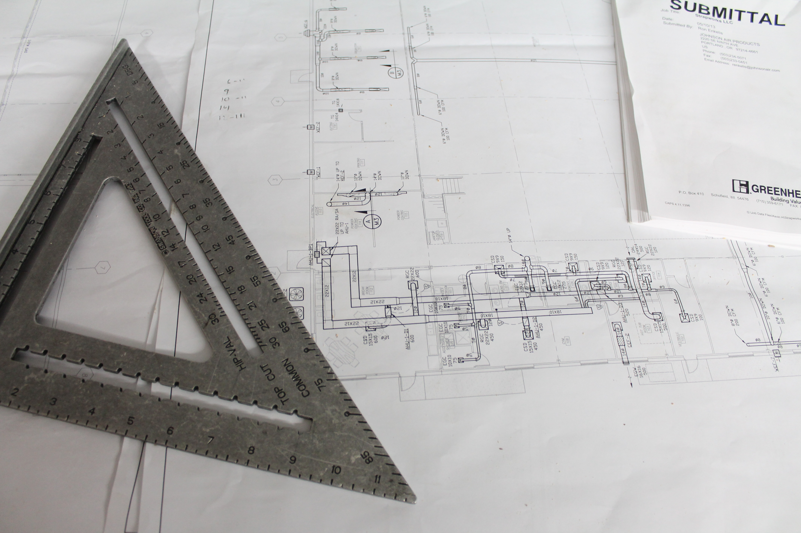

---
layout: essay
type: essay
title: "Effort Estimations"
# All dates must be YYYY-MM-DD format!
date: 2026-05-3
published: false
labels:
  - Software Engineering
---

## The Blueprints For Coding

Lets say for example, there is a situation where a person wants to build a house but not quite sure how to build the roof, instead of basically doing the eqivalent of trying to reinvent the wheel and trying to plan it all out from scratch, you can look at a blueprint in which already works and suits what you wanted. 

In this example, it is very similar to Design Patterns in which they are the blueprints for coding. Over time, developers would have encountered the same structural problems. But through the documentation of reccuring issues they can make reusable approaches so that if anyone else faces the same problem, they won't have to do it from scratch.

An example of its application can be shown in my own project where for example I wanted to make a search bar for my UI. Instead of having to trying to make it for scratch, I can look at already preexisting ones and alter it to fit what I wanted.
