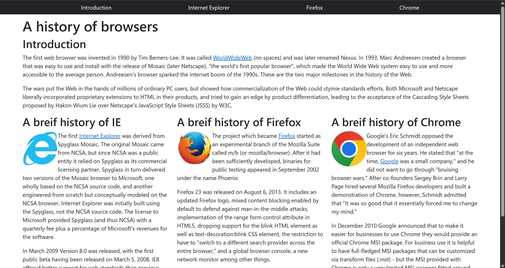
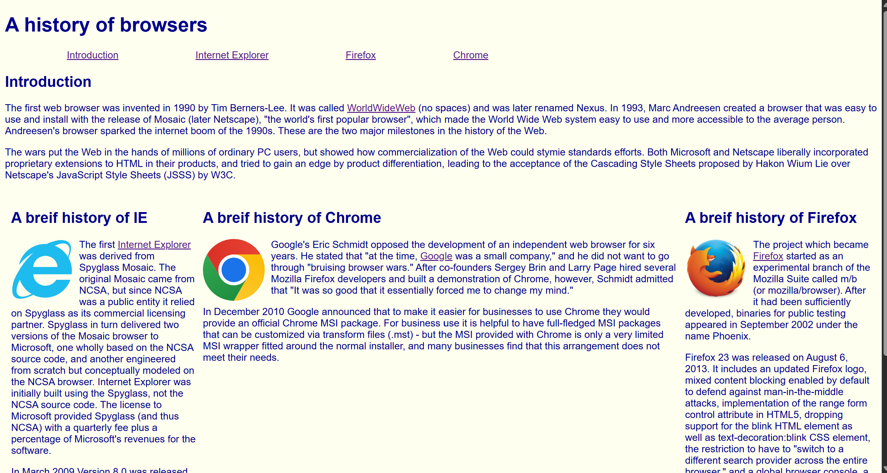

## My thoughts on Bootstrap 5

As of writing this essay I find that learning and trying to use Bootstrap 5 can be frustrating at times. It can sometimes get confusing for what certain classes does how they should be formatted and that it is difficult trying to memorize what each attribute exactly does. Although I find learning this UI Framework very difficult I can see it's usefulness when used correctly. It can make developing a website much faster than coding from scratch since built in components like navbars which greatly helps in making headers. Another example could be when you want to adjust the padding or margin of an element, usually you would have to change the style or change it in a css file but bootstrap gives classes m and p which gives a quick way to alter spacing. Other than being able to help develop a website much faster, it is also very customizable.

## Bootstrap 5 usage

